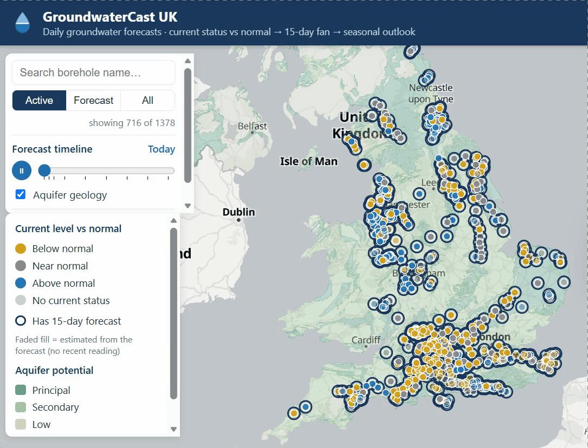
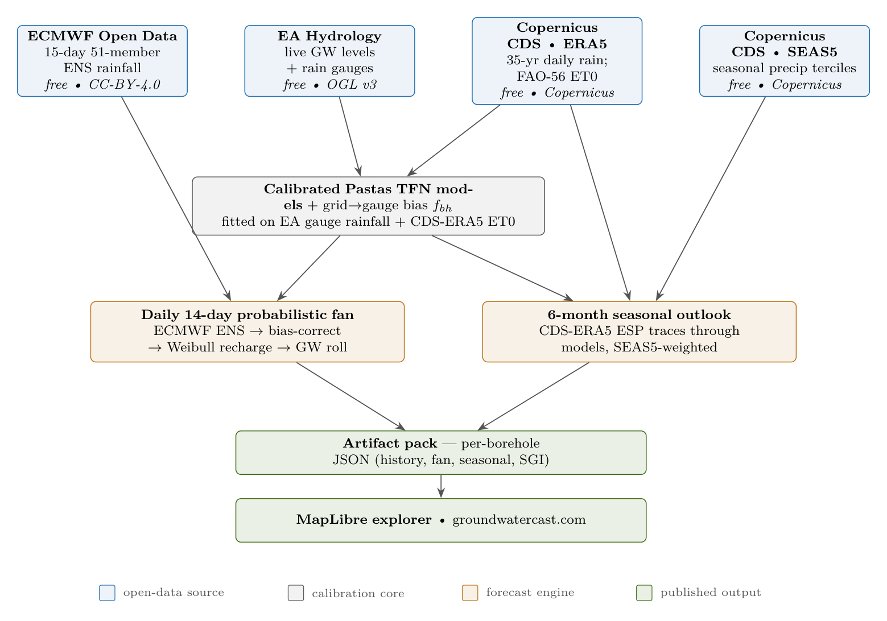

# 💧 GroundwaterCast UK

[](https://github.com/dominicm2023/groundwatercast-uk/actions/workflows/tests.yml)

**Per-borehole probabilistic groundwater forecasts for England — a 14-day daily
fan and a 6-month seasonal outlook — plus RiverCast, daily low-flow outlooks
for chalk streams. Built entirely on free, commercially-licensed open data.
Live at [groundwatercast.com](https://groundwatercast.com).**

<p align="center">
  
</p>
<p align="center"><em>Press play and watch the forecast evolve — today → 6 months ahead, every monitored borehole.</em></p>

<p align="center">
  
</p>

GroundwaterCast turns open weather and hydrology feeds into one forecast view
per monitored borehole, across three horizons in a single vocabulary —
**below / near / above normal**:

- **Current status vs normal** — the latest observed level (extended to within
  the hour by live EA telemetry where available) placed against the borehole's
  own monthly climatology: below/near/above normal, an approximate percentile,
  and a 7-day trend.
- **Forecast outlook (14 days)** — a probabilistic forecast per borehole:
  P10/P50/P90 fan, breach probability against your thresholds, and
  first-crossing dates, driven by all **51 ECMWF ENS rainfall members** through
  a calibrated per-borehole recharge model (Pastas transfer-function), with a
  reduced-form roll as cross-check.
- **Seasonal outlook (experimental)** — months 1–6 tercile probabilities per
  borehole: historic-year **ESP** forcing traces (Copernicus ERA5) through the
  calibrated model, weighted by **ECMWF SEAS5** monthly rainfall terciles.
  Rebuilt monthly.

> **Status: early.** The engine + explorer span **~1,378 monitored boreholes
> across England, 687 of which carry the full forecast**, plus **94 river
> gauges with daily low-flow outlooks**. Forecast uncertainty is **indicative — uncalibrated**
> until a full archived winter has been verified; the seasonal outlook is
> **experimental**.
>
> Independent open-source project — **not affiliated with or endorsed by** the
> Environment Agency, ECMWF, or any water company.

## Built entirely on free, commercial-clean open data

Every input is free to use **and** licensed for commercial redistribution — no
proprietary or paid feeds anywhere in the pipeline. The hosted service therefore
carries **zero recurring data cost** and is reproducible by anyone with a single
free Copernicus account.

| Source | Provides | Licence |
|---|---|---|
| **ECMWF Open Data** | 15-day, 51-member ENS rainfall forecast (GRIB) | CC-BY-4.0 |
| **Copernicus CDS — ERA5** | 35-yr daily rainfall history + met fields → self-computed FAO-56 ET0 | Copernicus (free, commercial, attribution) |
| **Copernicus CDS — SEAS5** | seasonal monthly rainfall terciles | Copernicus (free, commercial, attribution) |
| **Environment Agency Hydrology** | live groundwater levels + rain gauges | OGL v3 |

The story of getting there — off a convenient-but-non-commercial API onto these
free commercial-clean sources — is in
[`docs/free_data_migration.md`](docs/free_data_migration.md), including the one
documented residual (a dormant non-commercial bias-fit path used only when a
brand-new station is added, scheduled for retirement).

## Quick start

Requires **Python ≥ 3.13**.

```bash
git clone https://github.com/dominicm2023/groundwatercast-uk.git && cd groundwatercast-uk
pip install -r requirements.txt

python -m src.catalogue.build       # EA station catalogue for the configured region
python -m src.pipeline.run          # download readings + build features
python -m scripts.run_chain --core  # derived artefacts (shards, freshness, monthly normals)

streamlit run app.py                # interactive dashboard → http://localhost:8501
```

The published, lightweight view is the static **MapLibre explorer**
(`python scripts/serve_explorer.py`), which consumes the artifact pack — that's
what runs at **[groundwatercast.com](https://groundwatercast.com)**.

### Forecast + seasonal (extra setup)

Three one-time pieces unlock the full forecast:

1. **A free Copernicus CDS account** — drop the key in `~/.cdsapirc`. Unlocks
   the ERA5 history (recharge calibration + ESP traces) and SEAS5 seasonal
   weighting.
2. **The ECMWF Open Data GRIB stack** — `pip install -r requirements-grib.txt`
   (the daily 15-day ensemble; `provider: ecmwf_opendata` in `config/config.json`).
3. **A Pastas environment** for model calibration (numba/llvmlite, kept out of
   the main env):

   ```bash
   python -m venv .venv-pastas
   .venv-pastas/bin/pip install -r requirements-pastas.txt   # Scripts\pip on Windows
   ```

Then:

```bash
python -m scripts.refresh_pet           # ERA5 met → FAO-56 ET0 cache (via CDS)
python -m scripts.run_chain --pastas    # calibrate per-borehole models
python -m scripts.run_chain --forecast  # daily refresh (ECMWF ENS + Pastas)
python -m scripts.run_chain --seasonal  # monthly seasonal outlook (ESP × SEAS5)
python -m scripts.run_chain --live      # hourly live-tail refresh (EA)
```

On a host with cron, schedule those; container deployment is in `docs/deploy.md`.

### Your operational thresholds

Breach probabilities are computed against per-borehole levels you declare in
`data/thresholds/user_thresholds.yaml`:

```yaml
thresholds:
  - station_id: "abc12345-6789-..."   # EA hydrology station GUID
    mAOD: 41.2                        # breach level, metres AOD
    label: "Cellar flooding onset"
    source: "Parish flood plan 2024"
```

Boreholes without one fall back to their own P90 level, clearly badged as a
proxy.

## RiverCast — low-flow river forecasts

The same machinery, pointed at rivers: daily 14-day low-flow outlooks for
**94 river gauges** — England's chalk streams and winterbournes, every gauge
that passed its own forecast-skill gate (a leakage-safe hindcast against a
naive-recession baseline; **97 of 1,087 EA flow gauges** qualified tier-1,
minus a small curated set of operationally-controlled artificial channels —
reasons recorded in `scripts/select_flow_pilot.py`). Each gauge gets a
**two-pathway Pastas model on log-flow** — a slow baseflow path (the aquifer
draining, the physics shared with the boreholes) plus a quickflow path —
driven by the same 51-member ENS rainfall. The rivers have their own front
page at [groundwatercast.com/rivers](https://groundwatercast.com/rivers/).

Honesty caveats, carried on every river page: gauged flow **includes
abstraction and discharge effects**; rating curves are least accurate exactly
at low flows; Q95 thresholds are **climatological proxies**, not licence
Hands-off-Flow values.

The flow stages hang off the same `run_chain` groups (ingest `0c`, forecast
`8f/8h-flow`, seasonal shadow `9c`) and **skip gracefully** when no flow pilot
is set up, so the groundwater-only quick start above is unaffected. To build
the river layer: `python -m scripts.build_flow_catalogue`, then
`scripts.flow_fleet_scan` to score gauges and `scripts.select_flow_pilot` to
choose the publishable set.

## How it works

The diagram at the top **is** the pipeline: open sources → per-borehole
calibration → a daily fan and a seasonal outlook → a published artifact pack and
explorer. Methodology lives in [`docs/model.md`](docs/model.md) (current status +
recharge), [`docs/ensemble_forecast_design.md`](docs/ensemble_forecast_design.md)
(forecast), [`docs/free_data_migration.md`](docs/free_data_migration.md) (the
open-data architecture), and [`docs/uk_data_coverage.md`](docs/uk_data_coverage.md)
(national coverage).

*(Regenerate the diagram: `tectonic docs/dataflow_diagram.tex --outdir docs` then
`python scripts/render_dataflow.py`.)*

## Development

```bash
python -m pytest -q   # the suite runs standalone — no downloaded data needed
```

CI runs the suite on every push/PR. House rules: config-driven (no hardcoding),
time-based train/test splits only (no leakage), raw API responses cached for
audit, small testable modules.

## Roadmap

- ✅ **England-wide scale-up** — 687 forecast boreholes on the CDS/ECMWF
  open-data pipeline
- ✅ **Public static explorer** — live at
  [groundwatercast.com](https://groundwatercast.com), consuming the daily pack
- ✅ **RiverCast** — full tier-1 fleet: 94 river gauges with daily low-flow
  outlooks, a `/rivers/` front page, an explorer rivers view with OS Open
  Rivers geometry, and a page per gauge
- 📋 **Verification + fan calibration** after the first archived winter
- 📋 **Scotland adapter** (SEPA's separate time-series API)

## Citation & licence

MIT — see [LICENSE](LICENSE); the third-party data-attribution table
(EA OGL v3, ONS OGL v3, ECMWF CC-BY-4.0, Copernicus) is in [NOTICE](NOTICE).
If you use the software or its forecasts, please cite it — see
[`CITATION.cff`](CITATION.cff).
